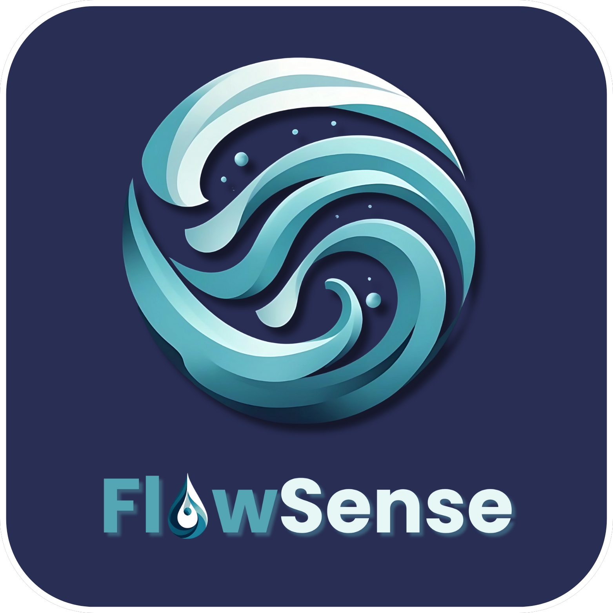

  

# Team FlowSense 🌊

Welcome to our project repository! This portfolio showcases our work on the HydroLink prototype, developed as part of our school requirements for Human-Computer Interaction.

---

## About Us 🖋️
We are a group of 2nd year Computer Science students tasked to design a prototype for an application that implements good UI and UX design for our Human-Computer Interaction subject. We decided to make a prototype for an app that allows users to monitor and interact with the city's water services provider, Davao City Water District (DCWD).

---

## Logo Design Philosophy 🤓
The design choices reflect the core values and identity of our team. The gradient of aqua and teal shades represents calmness, adaptability, and clear thinking — qualities we aim to embody in our collaboration. A deep blue background provides strong contrast and depth, while also conveying trust and professionalism. The circular swirl motif symbolizes unity, continuous improvement, and the natural rhythm of teamwork.

Integrating a droplet into the "O" of "Flow" reinforces our water-inspired theme and strengthens the visual identity. For typography, we chose a smooth, rounded font to convey friendliness and cohesion, with balanced lettering that ensures clarity while maintaining a sleek, modern aesthetic.

---

## Team Members 👩🏻‍💻
- H. V. Alalim – [GitHub Profile](https://github.com/HeraldAlalim)
- D. C. M. Amihan – [GitHub Profile](https://github.com/dcmcamihan)
- J. B. Bermudez – [GitHub Profile](https://github.com/Yan/i13)
